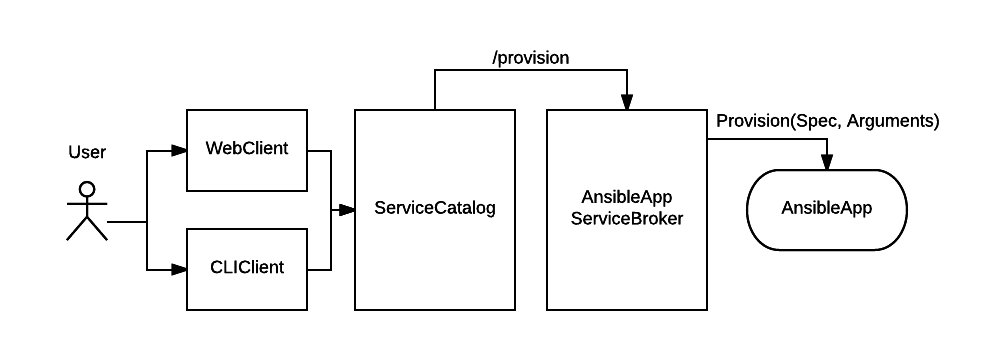

# Ansible Playbook Bundles (APB) Integration

## Running Playbook Bundles with the Ansible Service Broker

Ansible Playbook Bundles (APB) should be executed by the broker via the docker client (APIs):

`docker run $container_name $action $arguments`

> TODO: Document the docker client API code used to create and run these containers.
> For now, we are running the docker cli tool via scripts until this can be sorted.

See [APB design](https://github.com/ansibleplaybookbundle/ansible-playbook-bundle/blob/master/docs/design.md)
for details for argument requirements and expectations

## Targeting a cluster for APB deployment

> NOTE: This is a WIP, initial thoughts are as follows

Seen in the [APB design](https://github.com/ansibleplaybookbundle/ansible-playbook-bundle/blob/master/docs/design.md), an `ArgumentsObject` requires a `ClusterObject`
intended to provide details for connecting and authenticating with a targeted
cluster.

Seen in the left of the diagram are the clients into a cluster that
a user will use to deploy and manage APBs. These clients are also what
a user will interact with to target and authenticate with a given cluster.

Since these clients are the source for cluster details, it makes sense to
have them forward cluster details through the ServiceCatalog to a Broker.
The broker can then transform them into a `ClusterObject` and provide
this object when performing an action (Provision, Bind, etc...)

The APB contains an `oc` client which can then act on the behalf of
the clients the user is driving and authenticated with.
